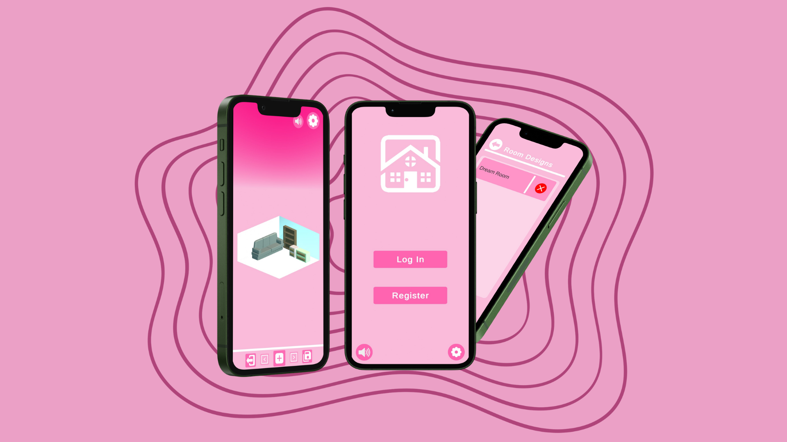

# Design It&nbsp; 

## Index

1. [Introduction](#introduction)
2. [Features](#features)
3. [Tools & Technologies](#tools--technologies)
4. [Key Learning Outcomes](#key-learning-outcomes)
5. [Screenshots](#screenshots)
6. [How to Run](#how-to-run)

## Introduction 

**Design It!** is a room design application created as part of my final degree project for the *Cross-Platform Application Development* program. The aim is to provide an intuitive tool for users to design and visualize their interior spaces quickly and easily.

This project is my first venture into Unity development and has served as a valuable learning experience, allowing me to master key aspects of the Unity environment and integrate Firebase for data management.

## Features

- **Room Layout Creation**: Users can create room layouts by inputting dimensions, with automatic wall generation.
- **Furniture Catalog**: A predefined menu of furniture items, filterable by categories, is available for selection and placement in the room.
- **Object Manipulation**: Objects can be dragged, rotated, scaled (with limits), and deleted through the user interface.
- **Customization**: Users can change the color of objects, both primary and secondary colors, when applicable.
- **Collision Detection**: Objects will show in red when colliding with others during placement.
- **Perspective Control**: The room view can rotate 90 degrees, with the option to hide walls for a clearer view.
- **3D Object Preview**: A 3D preview of selected objects is shown in the UI during the editing mode.
- **Camera Adjustment**: The camera dynamically adjusts based on room size, ensuring the entire layout remains visible.
- **Cloud Saving**: Users can save their designs in the cloud and access them later for editing or deletion.
- **Sound Integration**: Adjustable sound effects and background music enhance user experience, with sounds triggered when placing objects.

## Tools & Technologies

- **Unity**: Main development platform.
- **Firebase**: Realtime cloud database.

## Key Learning Outcomes

- Gained hands-on experience with Unity's core mechanics and features.
- Mastered Firebase integration for real-time data storage and management.
- Developed and tested a complete application, receiving user feedback to enhance usability.

## Screenshots

## How to Run

1. Clone the repository.
2. Open the project in Unity.
3. Ensure Firebase is set up for your project (remember to add google-services file).
4. Build and run the project on your preferred platform (meant for Android).
